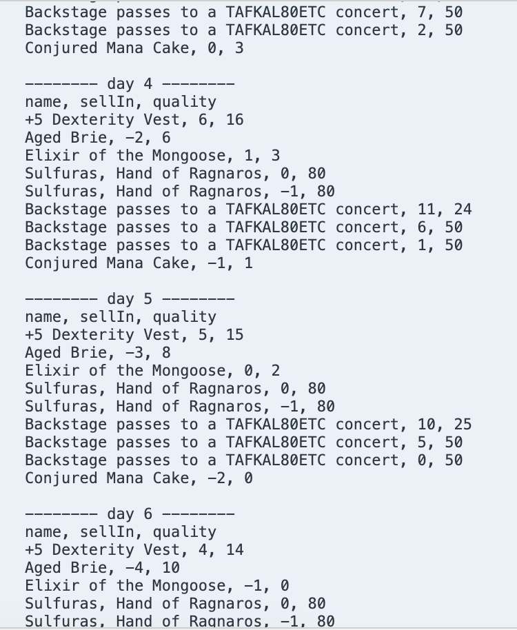

# Gilded Rose Tech test #

I have been asked by Allison, the propietor of a small, well situated hostelry, to update the inn's inventory management system so that it can account for a new type of product. The system's previous developer Leeroy had a clear penchant for if/else statements and the code required a little re-organizing before I felt comfortable adding in the new functionality required. 

## Features ##

This is the outline for the program as it was when it reached me:

	- All items have a SellIn value which denotes the number of days we have to sell the item
	- All items have a Quality value which denotes how valuable the item is
	- At the end of each day our system lowers both values for every item

More specifically:  
	- Once the sell by date has passed, Quality degrades twice as fast  
	- The Quality of an item is never negative  
	- "Aged Brie" actually increases in Quality the older it gets  
	- The Quality of an item is never more than 50  
	- "Sulfuras", being a legendary item, never has to be sold or decreases in Quality  
	- "Backstage passes", like aged brie, increases in Quality as its SellIn value approaches;  
    Quality increases by 2 when there are 10 days or less and by 3 when there are 5 days or less but  
	Quality drops to 0 after the concert

This was the specification for the new type of item the system needed to account for: 

- "Conjured" items degrade in Quality twice as fast as normal items

To ensure my refactored version continued to meet these requirements I wrote unit tests to test each individual requirement and created an overarching feature test based on the Golden Copy. I created feature tests for both the original specification and the new specification (i.e. a new set of feature tests that account for the introduction of the new 'Conjured' items).

The program now meets all of these requirements, is much more readable and encapsulated and is fully tested. 

## Code and Tests ## 

The program was written in Javascript and tested with Jasmine. 

To run the tests simply open specRunner.html in your browser. The Golden Copy is saved in lib. 

## Installation ## 

To run the program download it from this repo. You will then be able to create a new Shop object, passing in Item objects. Update the number of ```days``` and which Items you would like to include in the ```items``` array. You can then run the updateItems function as below for a readable print out of your inventory: 

``` 
    const items = [
      new Item("+5 Dexterity Vest", 10, 20), //
      new Item("Aged Brie", 2, 0), //
      new Item("Elixir of the Mongoose", 5, 7), //
      new Item("Sulfuras, Hand of Ragnaros", 0, 80), //
      new Item("Sulfuras, Hand of Ragnaros", -1, 80),
      new Item("Backstage passes to a TAFKAL80ETC concert", 15, 20),
      new Item("Backstage passes to a TAFKAL80ETC concert", 10, 49),
      new Item("Backstage passes to a TAFKAL80ETC concert", 5, 49),
      new Item("Conjured Mana Cake", 3, 6)
    ];

    var gildedRose = new Shop(items)
    var days = 1;
    
    var actualResult = ""
    for (let i = 0; i < days; i++) {
    actualResult = actualResult + ("-------- day " + i + " --------\n");
    actualResult = actualResult + ("name, sellIn, quality\n");
    items.forEach(element => {
      actualResult = actualResult + (element.name + ', ' + element.sellIn + ', ' + element.quality +"\n");
    });
    gildedRose.updateItems()
    }
    console.log(actualResult)
```

## Example Output ##

Below is a section of an example of what above code will print:


## Credits ##

Completed by Ben Gittins. 

This Kata was taken from Emily Bache's Gilded Rose Kata Repo: https://github.com/emilybache/GildedRose-Refactoring-Kata